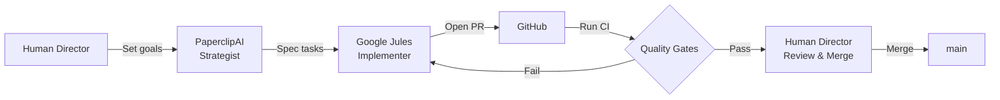

# Project Emberfall — An AI-Powered Godot Tactics Engine

[](https://github.com/niyazmft/emberfall/actions/workflows/ci.yml)
[](LICENSE)
[](https://godotengine.org/)

A deterministic, grid-based tactics engine built entirely in **Godot 4.6.3**, developed exclusively for **Windows, Linux, and macOS** desktop platforms.

> **Unique angle:** Project Emberfall is constructed and maintained by a workforce
> of specialized AI agents, demonstrating a novel approach to automated game
> development. See [Development Workflow](#development-workflow) for details.

## Gameplay

> 📸 *Screenshots and gameplay GIFs coming soon. The project has successfully delivered its Phase 5 Vertical Slice Demo (all 388 unit tests passing with 0 failures), completed Phase 6 (Design Tokens & Structural Layouts), and is wrapping up Phase 7 (Premium Asset Injection). Only 3 asset-dependent issues remain open before the Premium UI Overhaul is complete.*

## Features

- **Engine:** Godot 4.6.3 (Stable), targeting Windows, Linux, and macOS
- **Deterministic Combat:** 100% deterministic math, identical outcomes on all platforms
- **Grid-Based Tactics:** Flexible 12×12 grid with elevation and cover
- **Elemental System:** Fire/Oil/Wind/Water interactions with combo effects
- **Moral Weight System:** Optional kill/spare tracking that affects later runs
- **EPT Deuteranopia Accessibility:** Procedural patterns make the game accessible
  to players with Deuteranopia
- **Metadata-Driven Audio:** Burden/captioning system for dynamic in-game events

## Quick Start

### Requirements

| Tool | Version | Notes |
|------|---------|-------|
| Godot Engine | **4.6.3** | Other 4.x versions may work but are untested |
| Python | **3.10+** | Only required for the math validation script |
| Git | latest | For version-controlled git hooks |

### Run the Game

1. Clone the repository
2. Launch Godot and import `project.godot`
3. Press **F5** to run the main scene

### Run Validation

```bash
bash tools/pre_push_check.sh
```

This runs the same checks as CI: `gdformat`, `gdlint`, markdownlint, math
validation, and a headless editor scan.

## Development Workflow

Emberfall is developed through a coordinated multi-agent AI pipeline:



- **PaperclipAI** — High-level strategist, defines project goals and architecture
- **Google Jules** — Implements features through specialized personas (**Bolt** for performance, **Palette** for UX/UI, **Sentinel** for security)
- **Domain Agents** — Task boards for `game-engine`, `creative-assets`, and `story-level` manage isolated agile backlogs inside `.agents/`
- **Human Director** — Final approval, code review, and project direction

For contribution guidelines and agent instructions, see [AGENTS.md](AGENTS.md) and [CONTRIBUTING.md](CONTRIBUTING.md).

## Tech Stack

- **Engine:** [Godot 4.6.3](https://godotengine.org/) (GDScript)
- **Testing:** [GdUnit4](https://github.com/MikeSchulze/gdUnit4) for automated unit test suite
- **Validation:** [Python 3.10+](https://www.python.org/) for cross-platform math checks
- **Formatting:** [gdtoolkit](https://github.com/Scony/godot-gdscript-toolkit) (`gdformat` / `gdlint`) and `gdscript_formatter` addon
- **Pre-commit Hooks:** [pre-commit](https://pre-commit.com/) framework
- **CI:** [GitHub Actions](https://github.com/features/actions)
- **Linting:** [markdownlint-cli](https://github.com/igorshubovych/markdownlint-cli)
- **Platform API:** [GodotSteam](https://godotsteam.com/) GDExtension for Steamworks integration

## Project Structure

```text
emberfall/
├── project.godot
├── AGENTS.md            # Agent behavioral guidelines and architecture
├── ARCHITECTURE.md      # System architecture documentation
├── CONTRIBUTING.md      # Setup, branch strategy, code standards
├── CODE_OF_CONDUCT.md   # Contributor Covenant v2.1
├── LICENSE              # MIT License
├── SECURITY.md          # Vulnerability disclosure process
├── main_theme.tres      # Custom Godot theme
├── scenes/              # TSCN scene files
│   └── enemies/         # Enemy scene definitions
├── scripts/
│   ├── ai/              # Enemy behavior trees
│   ├── autoload/        # ~29 global systems (EventBus, GridSystem, SaveManager, …)
│   ├── burden/          # Moral weight events
│   ├── combat/          # Combat orchestration
│   ├── core/            # Math, combat, constants (deterministic)
│   ├── entities/        # Entity data + state lifecycle
│   ├── inventory/       # Item/equipment management
│   ├── skills/          # Ability definitions
│   ├── state_machine/   # FSM framework
│   ├── ui/              # UI components and screens
│   └── visual/          # Entity proxies, grid rendering
├── .agents/             # Agent task boards and custom Godot skills
├── .jules/              # Persistent memory and learning files for AI personas
├── .githooks/           # Version-controlled pre-commit and pre-push hooks
├── .github/             # GitHub Actions workflows and issue templates
├── assets/              # Sprites, fonts, audio, shaders
│   ├── audio/
│   ├── fonts/
│   ├── icons/
│   ├── locales/
│   ├── palettes/
│   ├── particles/
│   ├── shaders/         # GDShader files (post-process, sprite, CVD simulation)
│   ├── sprites/
│   └── textures/
├── config/              # JSON-driven tunable constants
│   └── rooms/           # Room template JSON files
├── data/                # Runtime data (props, ambient narrator, captioning)
│   └── captioning/
├── docs/                # Design specs and schemas
│   └── schemas/         # JSON schema validation files
├── localization/        # CSV + compiled .translation files (EN/DE/ES/FR)
├── reports/             # Generated test and benchmark reports
├── tests/               # Unit tests
│   └── benchmark/       # Performance benchmarks (not in CI)
└── tools/               # Scripts and utilities (hooks, validation, helpers)
    └── project_management/
```

## Determinism Guarantees

- **Math:** All combat math routes through `DeterministicMath` helpers;
  `float` → `int` truncation uses `floor()` with explicit clamp
- **Seeds:** `SeedGovernance.hash_seed()` produces deterministic 63-bit positive
  integers via SHA-256 → truncation
- **Cross-Platform:** Validation script mirrors GDScript logic in Python;
  both must agree bit-for-bit

## Roadmap

- [x] Deterministic math core (`DeterministicMath`, `CombatFormula`)
- [x] 12×12 grid with elevation and cover (`GridSystem`)
- [x] Elemental resolver (fire/oil/wind/water combos)
- [x] State machine framework (`BaseStateMachine`, `RunManager`)
- [x] Burden/Moral Weight tracking (`BurdenManager`)
- [x] Apparition (death effect) renderer
- [x] Procedural room generation (`RoomGenerator`, `EncounterSystem`)
- [x] Save/load with deterministic re-seeding (`SaveManager`)
- [x] Localization (EN/DE/ES/FR) wiring (`LocalizationManager`)
- [x] Dynamic audio routing and burden stems (`AudioMiddleware`, `BurdenStemCaptionRouter`)
- [x] Subtitle and narrative captioning (`CaptionManager`, `AmbientNarrator`)
- [x] UI Accessibility and aesthetics (CVD mode, dynamic styling, focus management)
- [x] Vertical slice playable demo (Phase 5 Complete)
  - [x] Loop closure: Return to Menu from Victory/Defeat/Pause (#411, #412, #413)
  - [x] End condition: cap rooms or add run-complete screen (#414)
  - [x] Visual identity: title art, environment props, hit effects (#415, #416, #417)
  - [x] Engine stability: stale refs, signal leaks, infinite-loop abort (#418, #419, #420)
  - [x] Level design: biome rooms, boss variety, hazards (#421, #422, #423)
  - [x] Narrative: premise, burden variants, ambient captions (#424, #425, #426)
- [x] Phase 6: Design Tokens & Structural Layouts (main_theme, TitleScreen, bottom console, SettingsPanel, camera zoom, popups) — Complete via PR #528
- [x] Phase 7: Premium Asset Injection (production sprites, soft shadows, combat icons, prop sprites) — Nearly Complete via PRs #530–#532
  - [x] Production entity sprites (9 characters) and soft radial shadows (#455)
  - [x] Premium combat action & ability icons (move, attack, end turn, strike, ember, quick dash) (#510)
  - [x] Bespoke 2D environmental prop sprites (8 props) (#513)
  - [x] Minimap decorative border frame (#511)
  - [ ] 9-patch StyleBoxTextures for buttons & modals (#512 — asset-dependent)
  - [ ] Mastered SFX replacement (#514 — asset-dependent)
- [x] Phase 8: Motion Polish & Atmosphere (title glow, micro-animation tweens, TurnBanner ribbon, dissolving ember transition shader, GodotSteam bindings) — Partially Complete via PRs #530–#531
  - [x] Title glow shader (#515)
  - [x] Button Tween micro-animations (#516)
  - [x] TurnBanner ribbon animation (#517)
  - [x] Transition dissolve shader (#518)
  - [x] GodotSteam wrapper (#520)
  - [ ] Layered musical stems (#519 — asset-dependent)

## Contributing

Contributions are welcome. Please read [CONTRIBUTING.md](CONTRIBUTING.md) for
setup, branch strategy, and code standards. All PRs go through automated
quality gates (`gdformat`, `gdlint`, math validation) before review.

## License

This project is licensed under the **MIT License** — see [LICENSE](LICENSE)
for details. By contributing, you agree your contributions will be licensed
under the same terms.

## Code of Conduct

This project follows the [Contributor Covenant v2.1](CODE_OF_CONDUCT.md).
By participating, you are expected to uphold this code.

## Security

Vulnerabilities should be reported privately — see [SECURITY.md](SECURITY.md)
for the disclosure process.

## Acknowledgments

- [Godot Engine](https://godotengine.org/) — open-source game engine
- [GdUnit4](https://github.com/MikeSchulze/gdUnit4) by MikeSchulze for automated unit testing framework
- [gdscript_formatter](https://github.com/jmlee2k/gdscript-formatter) by jmlee2k for in-editor formatting automation
- `voxy/at-icons` for premium combat action and system menu icon assets
- `crystal-bit/godot-game-template`, `baconandgames/godot4-game-template`, and `four-games` for UI container hierarchy patterns, modal settings form layouts, and master theme token structures
- [GodotSteam](https://godotsteam.com/) for Steamworks API GDExtension bindings
- The GDScript community for tools, patterns, and shader techniques
- AI agent infrastructure: PaperclipAI, Google Jules
