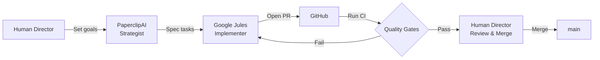

# Project Emberfall — An AI-Powered Godot Tactics Engine

[](https://github.com/niyazmft/emberfall/actions/workflows/ci.yml)
[](LICENSE)
[](https://godotengine.org/)

A deterministic, grid-based tactics engine built entirely in **Godot 4.6.3**, with a
focus on performance for Android via Termux.

> **Unique angle:** Project Emberfall is constructed and maintained by a workforce
> of specialized AI agents, demonstrating a novel approach to automated game
> development. See [Development Workflow](#development-workflow) for details.

## Gameplay

> 📸 *Screenshots and gameplay GIFs coming soon. The project is in pre-production
> with the AP economy, deterministic combat math, and grid system implemented
> in GDScript.*

## Features

- **Engine:** Godot 4.6.3 (Stable), optimized for Android via Termux
- **Deterministic Combat:** 100% deterministic math, identical outcomes on all platforms
- **Grid-Based Tactics:** Flexible 12×12 grid with elevation and cover
- **Elemental System:** Fire/Oil/Wind/Water interactions with combo effects
- **Moral Weight System:** Optional kill/spare tracking that affects later runs
- **EPT Deuteranopia Accessibility:** Procedural patterns make the game accessible
  to players with Deuteranopia
- **Metadata-Driven Audio:** Burden/captioning system for dynamic in-game events

## Quick Start

### Requirements

| Tool | Version | Notes |
|------|---------|-------|
| Godot Engine | **4.6.3** | Other 4.x versions may work but are untested |
| Python | **3.10+** | Only required for the math validation script |
| Git | latest | For version-controlled git hooks |

### Run the Game

1. Clone the repository
2. Launch Godot and import `project.godot`
3. Press **F5** to run the main scene

### Run Validation

```bash
bash tools/pre_push_check.sh
```

This runs the same checks as CI: `gdformat`, `gdlint`, markdownlint, math
validation, and a headless editor scan.

## Development Workflow

Emberfall is developed through a coordinated multi-agent AI pipeline:



- **PaperclipAI** — High-level strategist, defines project goals and architecture
- **Google Jules** — Implements features from specifications and responds to review feedback
- **Human Director** — Final approval, code review, and project direction

For contribution guidelines, see [CONTRIBUTING.md](CONTRIBUTING.md).

## Tech Stack

- **Engine:** [Godot 4.6.3](https://godotengine.org/) (GDScript)
- **Validation:** [Python 3.10+](https://www.python.org/) for cross-platform math checks
- **Formatting:** [gdtoolkit](https://github.com/Scony/godot-gdscript-toolkit) (`gdformat` / `gdlint`)
- **Pre-commit Hooks:** [pre-commit](https://pre-commit.com/) framework
- **CI:** [GitHub Actions](https://github.com/features/actions)
- **Linting:** [markdownlint-cli](https://github.com/igorshubovych/markdownlint-cli)

## Project Structure

```text
emberfall/
├── project.godot
├── CONTRIBUTING.md      # Setup, branch strategy, code standards
├── scenes/
├── scripts/
│   ├── core/            # Math, combat, constants (deterministic)
│   ├── entities/        # Entity data + state lifecycle
│   ├── autoload/        # 16 global systems (EventBus, GridSystem, SaveManager, …)
│   ├── shaders/
│   └── state_machine/
├── assets/
├── config/              # JSON-driven tunable constants
├── localization/        # CSV + compiled .translation files (EN/DE/ES/FR)
├── schemas/             # JSON schema validation files
├── prototype/           # Throwaway Python research — see below
└── tests/
    └── benchmark/       # Performance benchmarks (not in CI)
```

## Determinism Guarantees

- **Math:** All combat math routes through `DeterministicMath` helpers;
  `float` → `int` truncation uses `floor()` with explicit clamp
- **Seeds:** `SeedGovernance.hash_seed()` produces deterministic 63-bit positive
  integers via SHA-256 → truncation
- **Cross-Platform:** Validation script mirrors GDScript logic in Python;
  both must agree bit-for-bit

## Prototype Archive

The `prototype/` directory contains **throwaway Python research scripts** used
during pre-production (DON-1). They validated the core AP-economy and
grid-positioning formulas before porting to GDScript.

> **Do not carry code forward from `prototype/` into production.** All findings
> are documented in [`prototype/FINDINGS.md`](prototype/FINDINGS.md). The
> Python scripts have served their purpose and exist only as a reference audit
> trail.

| File | Purpose |
|------|---------|
| `core_mechanic_prototype.py` | Playable terminal prototype (AP economy + positioning) |
| `grid_system.py` | Python grid/pathfinding reference implementation |
| `batch_simulation.py` | Quantitative scenario runner |
| `FINDINGS.md` | Full prototype report with results and recommendations |

## Roadmap

- [x] Deterministic math core (`DeterministicMath`, `CombatFormula`)
- [x] 12×12 grid with elevation and cover (`GridSystem`)
- [x] Elemental resolver (fire/oil/wind/water combos)
- [x] State machine framework (`BaseStateMachine`, `RunManager`)
- [x] Burden/Moral Weight tracking (`BurdenManager`)
- [x] Apparition (death effect) renderer
- [ ] Vertical slice playable demo
- [ ] Procedural room generation
- [ ] Localization (EN/DE/ES/FR) wiring
- [ ] Save/load with deterministic re-seeding

## Contributing

Contributions are welcome. Please read [CONTRIBUTING.md](CONTRIBUTING.md) for
setup, branch strategy, and code standards. All PRs go through automated
quality gates (`gdformat`, `gdlint`, math validation) before review.

## License

This project is licensed under the **MIT License** — see [LICENSE](LICENSE)
for details. By contributing, you agree your contributions will be licensed
under the same terms.

## Code of Conduct

This project follows the [Contributor Covenant v2.1](CODE_OF_CONDUCT.md).
By participating, you are expected to uphold this code.

## Security

Vulnerabilities should be reported privately — see [SECURITY.md](SECURITY.md)
for the disclosure process.

## Acknowledgments

- [Godot Engine](https://godotengine.org/) — open-source game engine
- The GDScript community for tools, patterns, and shader techniques
- AI agent infrastructure: PaperclipAI, Google Jules
