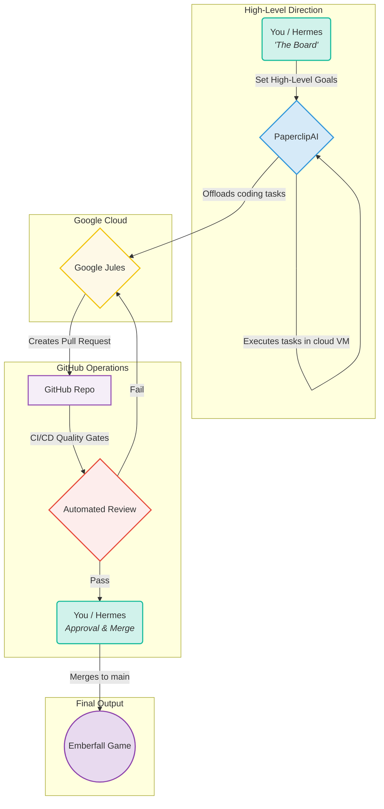

# Project Emberfall — An AI-Powered Godot Tactics Engine

Project Emberfall is a deterministic, grid-based tactics engine built entirely in **Godot 4.2.2**. What makes this project unique is its development process: it is constructed and maintained by a workforce of specialized AI agents, demonstrating a novel approach to automated game development, with a specific focus on performance for Android via Termux.

## The Studio: An Optimized Multi-Agent Workforce

This project is built by a team of AI agents, each with a specific role, managed and directed by a human operator. The team was strategically streamlined from a roster of 49 to 33 agents to optimize for token efficiency and budget constraints, showcasing a key aspect of AI resource management.



- **PaperclipAI**: The high-level strategist, responsible for defining project goals and long-term planning.
- **You / Hermes**: The lead architect and quality assurance lead, responsible for designing the core systems, enforcing engineering standards, and reviewing all code.
- **Google Jules**: The junior developer, responsible for implementing features based on the architect's specifications and responding to code review feedback.
- **Human Director**: The human-in-the-loop, providing high-level direction, final approval, and managing the overall project.

## Core Engine Features

- **Engine**: Godot 4.2.2 (Stable), with a focus on performance for Android via Termux.
- **Deterministic Combat**: All combat math is 100% deterministic, ensuring identical outcomes on all platforms.
- **Grid-Based Tactics**: A robust and flexible grid system for tactical gameplay.
- **Burden/Captioning Audio System**: A metadata-driven audio system for dynamic in-game events.
- **EPT Deuteranopia Accessibility**: A shader-based system that uses procedural patterns to make the game accessible to players with Deuteranopia.

## Automated Quality Gates & Engineering Standards

The project is built on a foundation of high engineering standards, enforced by an automated quality gate system.

- **CI/CD Pipeline**: A GitHub Actions pipeline automatically runs a suite of checks on every pull request, including:
  - `gdscript-lint`: A headless editor scan to catch parse errors and strict typing violations.
  - `gdformat`: Ensures consistent code formatting across the entire project.
  - `validate-math`: A Python-based cross-check to guarantee determinism.
- **Local Validation**: A `pre_push_check.sh` script is provided to run all validation steps locally, ensuring that no broken code is ever pushed to the repository.
- **Agent-Facing Documentation**: The project includes detailed, agent-facing documentation, such as `JULES_GDSCRIPT_RULES.md`, to ensure that all AI-generated code adheres to the project's strict standards.

## Project Structure

```text
emberfall/
├── project.godot
├── scenes/
├── scripts/
│   ├── core/
│   ├── entities/
│   ├── autoload/
│   ├── shaders/
│   └── state_machine/
├── assets/
└── tests/
```

## Quick Start & Validation

### Open in Godot 4.2+

1. Launch Godot and import `project.godot`.
2. Press **F5** to run the main scene.

### Run Validation

To run the full suite of validation checks locally, use the `pre_push_check.sh` script:

```bash
bash tools/pre_push_check.sh
```

This script runs all the same checks that are performed by the CI/CD pipeline.

## Determinism Guarantees

- **Math**: All combat math routes through `DeterministicMath` helpers; `float` → `int` truncation uses `floor()` with explicit clamp.
- **Seeds**: `SeedGovernance.hash_seed()` produces deterministic 63-bit positive integers via SHA-256 → truncation.
- **Cross-Platform**: Validation script mirrors GDScript logic in Python; both must agree bit-for-bit.
